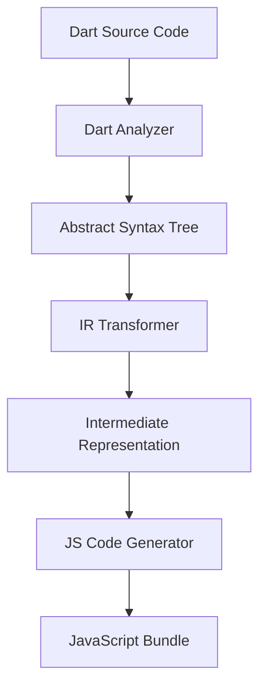

# Dart CLI Pipeline

The **Dart CLI Pipeline** is the build process that transforms your generic Flutter/Dart code into optimized JavaScript that the FlutterJS Runtime can execute.

## 🔄 The Pipeline Overview



### 1. Analysis Phase (`flutterjs_analyzer`)
The pipeline starts by analyzing your Dart code using the standard `analyzer` package.
- **Parsing**: Converts text to an AST (Abstract Syntax Tree).
- **Resolution**: Resolves symbols, types, and imports.
- **Validation**: Checks for unsupported features (e.g., `dart:io`).

### 2. Intermediate Representation (IR)
Instead of compiling directly to JS, we convert the AST into a custom **Intermediate Representation**.
This allows us to:
- Strip away Dart-specific syntax sugar.
- Flatten the class hierarchy.
- Optimize the structure for the JS runtime.

The IR contains:
- **Classes**: Widget definitions.
- **Methods**: `build`, `initState`, etc.
- **Properties**: Member variables.
- **Metadata**: Annotations like `@override`.

### 3. Code Generation (`flutterjs_tools`)
The final step converts the IR into JavaScript code (`.fjs` or `.js`).

#### Widget Conversion
A Dart `StatelessWidget` becomes a JS class extending `StatelessWidget`.

**Dart Input:**
```dart
class MyWidget extends StatelessWidget {
  @override
  Widget build(BuildContext context) {
    return Text('Hello');
  }
}
```

**JavaScript Output:**
```javascript
import { StatelessWidget, Text } from '@flutterjs/material';

export class MyWidget extends StatelessWidget {
  build(context) {
    return Text('Hello');
  }
}
```

### 4. Bundling
The generated JS files are bundled using a standard JS bundler (like `esbuild` or `webpack`) to produce the final `main.js` which is included in `index.html`.

## 🛠️ CLI Commands

- **`flutterjs create`**: Scaffolds a new project.
- **`flutterjs build`**: Runs the full pipeline to generate production assets.
- **`flutterjs run`**: Starts the development server with hot reload (watching for Dart file changes and re-running the pipeline).
