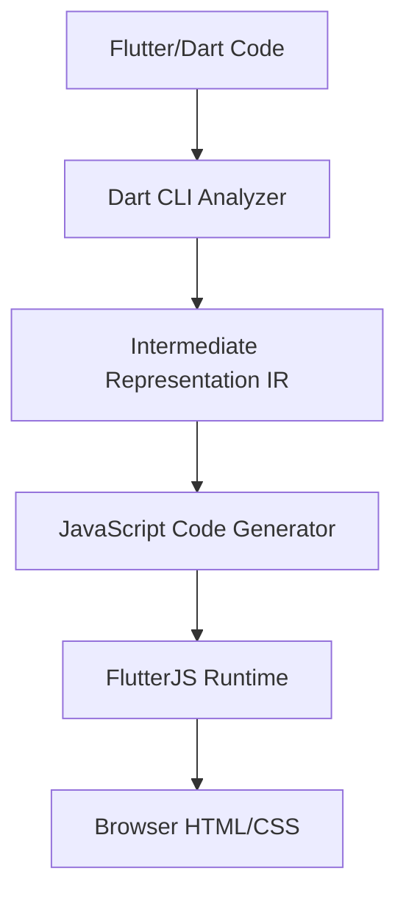

# FlutterJS Architecture Overview

Understanding how FlutterJS works under the hood.

---

## High-Level Architecture

FlutterJS consists of three main components:



### Components

1. **Dart CLI** — Analyzes and converts Flutter/Dart code
2. **IR (Intermediate Representation)** — Platform-independent code representation
3. **Code Generator** — Converts IR to JavaScript
4. **Runtime Engine** — JavaScript framework that renders widgets
5. **VDOM System** — Efficient DOM updates

---

## Architecture Layers

```
┌─────────────────────────────────────────────────────────┐
│  YOUR FLUTTER CODE (lib/main.dart)                      │
│  • StatefulWidget, StatelessWidget                      │
│  • Material Design widgets                              │
└───────────────────────┬─────────────────────────────────┘
                        │
                        ▼
┌─────────────────────────────────────────────────────────┐
│  DART CLI (Analysis & Conversion)                       │
│  • Parse Dart AST                                       │
│  • Type inference                                       │
│  • Generate IR                                          │
└───────────────────────┬─────────────────────────────────┘
                        │
                        ▼
┌─────────────────────────────────────────────────────────┐
│  INTERMEDIATE REPRESENTATION (Binary Format)            │
│  • Platform-independent                                 │
│  • Optimized for size                                   │
│  • FlatBuffers serialization                            │
└───────────────────────┬─────────────────────────────────┘
                        │
                        ▼
┌─────────────────────────────────────────────────────────┐
│  JAVASCRIPT CODE GENERATOR                              │
│  • Convert IR to .fjs files                             │
│  • Optimize for browser                                 │
│  • Generate imports                                     │
└───────────────────────┬─────────────────────────────────┘
                        │
                        ▼
┌─────────────────────────────────────────────────────────┐
│  FLUTTERJS RUNTIME (Browser)                            │
│  • Widget system (Widget, StatefulWidget, etc.)         │
│  • VDOM rendering                                       │
│  • State management                                     │
│  • Event handling                                       │
└───────────────────────┬─────────────────────────────────┘
                        │
                        ▼
┌─────────────────────────────────────────────────────────┐
│  BROWSER (HTML + CSS)                                   │
│  • Semantic HTML elements                               │
│  • CSS styling                                          │
│  • SEO-friendly                                         │
└─────────────────────────────────────────────────────────┘
```

---

## Key Design Decisions

### 1. Why Intermediate Representation (IR)?

**Problem:** Dart syntax is complex and constantly evolving.

**Solution:** Use an intermediate representation that:
- Abstracts away Dart language details
- Is easier to convert to JavaScript
- Can be optimized independently
- Enables future backends (Web Workers, WASM, etc.)

```
Dart Code → IR → JavaScript
         ↗        ↘
    (stable)    (easy to generate)
```

### 2. Why VDOM (Virtual DOM)?

**Problem:** Direct DOM manipulation is slow.

**Solution:** Virtual DOM provides:
- Efficient updates (only changed elements)
- Batched updates (via requestAnimationFrame)
- Predictable rendering
- Similar to React's approach

```dart
// Dart code
setState(() {
  counter++;
});

// VDOM updates
Old VDOM: VNode(tag: 'span', text: '5')
New VDOM: VNode(tag: 'span', text: '6')
Diff: Text content changed
Update: DOM element.textContent = '6'  // Only this!
```

### 3. Why Semantic HTML?

**Problem:** Flutter Web uses Canvas, which is invisible to search engines.

**Solution:** Generate semantic HTML:

```html
<!-- FlutterJS output -->
<div class="flutter-scaffold">
  <header class="flutter-appbar">
    <h1>Page Title</h1>
  </header>
  <main>
    <article>
      <p>Content here</p>
    </article>
  </main>
</div>
```

**Benefits:**
- SEO-friendly
- Accessible (screen readers)
- Smaller bundle size
- Works without JavaScript (partial)

---

## Data Flow

### Widget to HTML Flow

```dart
// 1. Dart Code
class MyWidget extends StatelessWidget {
  Widget build(BuildContext context) {
    return Container(
      color: Colors.blue,
      child: Text('Hello'),
    );
  }
}

// 2. Dart CLI converts to IR
IR {
  widget: "Container",
  props: { color: "#0000FF", child: TextNode }
}

// 3. Code Generator creates JavaScript
class _Container extends StatelessWidget {
  build(context) {
    return new VNode({
      tag: 'div',
      props: { style: { backgroundColor: '#0000FF' } },
      children: [new _Text('Hello')]
    });
  }
}

// 4. Runtime renders to DOM
<div style="background-color: #0000FF;">
  <span>Hello</span>
</div>
```

---

## Component Responsibilities

### Dart CLI

**Responsibilities:**
- Parse Dart source code (AST analysis)
- Build dependency graph
- Type inference and checking
- Generate IR files
- Convert IR to JavaScript
- Optimize output

**Location:** `packages/flutterjs_analyzer/`, `packages/flutterjs_tools/`

### JavaScript Runtime

**Responsibilities:**
- Widget lifecycle management
- VDOM creation and diffing
- DOM updates
- Event handling
- State management (setState)
- Theme management

**Location:** `packages/flutterjs_engine/src/`

### Build System

**Responsibilities:**
- Project initialization
- Dependency resolution
- Dev server with live reload
- Production builds
- Asset management

**Location:** `packages/flutterjs_engine/src/cli/`

---

## Performance Optimizations

### 1. Incremental Compilation

Only recompile changed files:

```
lib/main.dart changed
  ↓
Analyze: main.dart depends on [widget_a.dart, theme.dart]
  ↓
Recompile: main.dart only
  ↓
Skip: widget_b.dart, utils.dart (unchanged)
```

### 2. VDOM Diffing

Only update changed elements:

```javascript
// Old VDOM
VNode('div', { className: 'container' }, [
  VNode('span', {}, ['Count: 5'])
])

// New VDOM
VNode('div', { className: 'container' }, [
  VNode('span', {}, ['Count: 6'])
])

// Diff: Only text changed
// Update: element.textContent = 'Count: 6'
```

### 3. Batched Updates

```javascript
// Multiple setState calls
setState(() => counter++);
setState(() => text = 'Updated');
setState(() => items.add('X'));

// Batched into single render
requestAnimationFrame(() => {
  // Render once with all changes
});
```

---

## Project Structure

```
flutterjs/
├── bin/
│   └── flutterjs.dart              # Dart CLI entry point
├── packages/
│   ├── flutterjs_analyzer/         # Dart analyzer
│   │   └── lib/src/
│   │       ├── analyzer/           # AST analysis
│   │       ├── ir_generator/       # IR generation
│   │       └── model/              # Data models
│   ├── flutterjs_engine/           # JavaScript runtime
│   │   └── src/
│   │       ├── core/               # Widget system
│   │       ├── material/           # Material widgets
│   │       ├── vdom/               # Virtual DOM
│   │       └── cli/                # Dev server
│   └── flutterjs_tools/            # Build tools
│       └── lib/src/
│           ├── codegen/            # JS code generator
│           └── bridge/             # Dart-JS bridge
└── examples/
    ├── counter/                    # Example apps
    └── routing_app/
```

---

## Technology Stack

### Dart Side

- **Language:** Dart 2.17+
- **Analyzer:** Dart analyzer package
- **Serialization:** FlatBuffers (for IR)
- **CLI:** Dart args package

### JavaScript Side

- **Runtime:** ES6+ JavaScript
- **Bundler:** esbuild
- **Dev Server:** Express.js
- **Module System:** ESM (ES Modules)

---

## Comparison with Other Frameworks

| Feature | Flutter Web | FlutterJS | React |
|---------|-------------|-----------|-------|
| **Source Language** | Dart | Dart | JavaScript/JSX |
| **Output** | Canvas/WASM | HTML/CSS | HTML/CSS |
| **Rendering** | CanvasKit/HTML | VDOM → DOM | VDOM → DOM |
| **Bundle Size** | 2-5 MB | 50-100 KB | 100-200 KB |
| **SEO** | Poor | Good | Good |
| **Learning Curve** | Flutter | Flutter | React |

---

## Future Enhancements

### Planned Features

1. **Hot Module Replacement (HMR)**
   - Instant updates without page refresh
   - Preserve app state during development

2. **Code Splitting**
   - Load routes on demand
   - Reduce initial bundle size

3. **Service Workers / PWA**
   - Offline support
   - Background sync
   - Push notifications

4. **IPC Mode**
   - Tighter Dart CLI ↔ JS Engine communication
   - Real-time error reporting

---

## Next Steps

- Deep dive into [Dart CLI Pipeline](dart-cli-pipeline.md)
- Understand the [Runtime Engine](runtime-engine.md)
- Learn about [VDOM Rendering](vdom-rendering.md)
