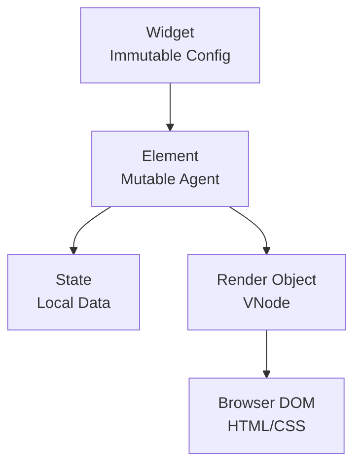

# Runtime Engine Architecture

The **FlutterJS Runtime** (`@flutterjs/runtime`) is the JavaScript engine that executes your application in the browser. It mimics the behavior of the Flutter framework but is optimized for the DOM.

## 🧠 Core Concepts

The runtime bridges the gap between the static Widget definition and the dynamic DOM updates.



### 1. The Element Tree
Just like in Flutter, there are three trees:
1.  **Widget Tree**: Immutable configuration (blueprint). Rebuilt frequently.
2.  **Element Tree**: Mutable instances that manage the lifecycle. Persistent.
3.  **Render Tree**: The visual description. In FlutterJS, this is the **VNode Tree**.

### 2. Element Typest

#### `ComponentElement`
The base class for elements that compose other widgets.
- **`StatelessElement`**: For `StatelessWidget`. It simply calls `build()`.
- **`StatefulElement`**: For `StatefulWidget`. It creates and holds a `State` object. It calls `state.build()`.

#### `RenderObjectElement`
(Conceptual in FlutterJS) These are elements that actually create VNodes (like `RawVNode` or leaf widgets).

### 3. State Management
The `State` class works exactly like in Flutter.

```javascript
class MyState extends State {
  initState() {
    // Called once upon mounting
  }

  didUpdateWidget(oldWidget) {
    // Called when parent rebuilds and sends new configuration
  }

  setState(fn) {
    // 1. Run the update function
    // 2. Mark this element as 'dirty'
    // 3. Schedule a frame
  }

  dispose() {
    // Called when unmounting
  }
}
```

### 4. BuildContext
`BuildContext` is actually the `Element` itself. It allows widgets to look up the tree.
- `context.findAncestorWidgetOfExactType(Theme)`: Used for `Theme.of(context)`.

---

## 🔄 The Rendering Pipeline

The runtime uses a batching scheduler to ensure efficient updates, similar to Flutter's "frame" concept.

1.  **Event**: User interaction or network event calls `setState()`.
2.  **Mark Dirty**: The element key is added to a `dirtyElements` set.
3.  **Schedule**: A microtask (Promise) is scheduled if not already pending.
4.  **Flush**:
    - The runtime iterates through `dirtyElements`.
    - It calls `rebuild()` on each.
    - `rebuild()` calls `build()` implementation (widget's build method).
    - The new Widget tree is compared to the old one.
    - If widget type/key matches -> **Update** element.
    - If different -> **Unmount** old, **Mount** new.
5.  **Render**: The resulting VNode tree is patched to the DOM.

## 📦 Update Batching

To avoid "layout thrashing" where the browser recalculates layout multiple times:

```javascript
// User code
setState(() => a++);
setState(() => b++);
setState(() => c++);

// Runtime
// 1. Adds 'a' to dirty list
// 2. Adds 'b' to dirty list
// 3. Adds 'c' to dirty list
// 4. End of event loop -> FLUSH ONCE
```

This ensures O(1) rendering cost per frame regardless of how many `setState` calls were made.
