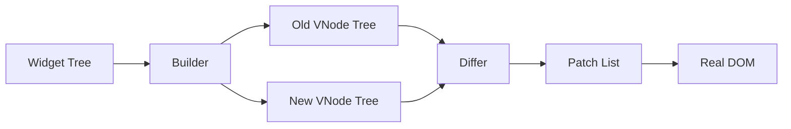

# Virtual DOM (VDOM) Rendering System

The **Virtual DOM** is an abstraction layer that allows FlutterJS to update the browser DOM efficiently. It minimizes direct DOM manipulation, which is a slow operation, by batching changes and applying only what is necessary.

## 🏗️ Architecture

The VDOM system consists of four main modules:

1.  **VNode System**: The data structure representing the UI.
2.  **Builder**: Converts high-level Widgets into low-level VNodes.
3.  **Differ (Reconciliation)**: Compares two VNode trees to find changes.
4.  **Patch Applier**: Applies those changes to the real DOM.



### 1. The VNode (`vnode.js`)
A `VNode` is a lightweight JavaScript object that describes a DOM element.

```javascript
{
  tag: 'div',
  props: { className: 'container' },
  style: { backgroundColor: 'red' },
  children: [ ... ],
  key: 'unique-id'
}
```

It creates a separation of concern:
- **Widgets** describe "what" (configuration).
- **VNodes** describe "how" (structure).

### 2. The Reconciliation Algorithm (`vnode_differ.js`)
We use a heuristic O(n) algorithm similar to React's. It assumes that if two elements have different types (tags) or different keys, they represent different trees.

#### Diffing Strategy
1.  **Type Check**: If `oldNode.tag !== newNode.tag`, replace the entire node.
2.  **Key Check**: If keys differ, treat as different nodes (essential for lists).
3.  **Prop Diff**: Compare `props`, `style`, and `events` to generate update patches.
4.  **Children**: Recursively diff children.

### 3. Patching (`patch_applier.js`)
The output of the differ is a linear list of **Patches**.

| Patch Type | Action |
| :--- | :--- |
| `CREATE` | `document.createElement()` |
| `REMOVE` | `node.remove()` |
| `REPLACE` | `node.replaceWith()` |
| `UPDATE_PROPS` | `setAttribute` / `removeAttribute` |
| `UPDATE_TEXT` | `node.textContent = ...` |

## 🚀 Server-Side Rendering (SSR) & Hydration

FlutterJS supports SSR to improve SEO and FCP (First Contentful Paint).

### SSR Pipeline
1.  **Server**: Runs the app in Node.js.
2.  **Render**: `SSRRenderer` traverses the VNode tree.
3.  **Output**: Generates a standard HTML string string.
4.  **Client**: The browser loads the static HTML.

### Hydration
When the JavaScript bundle loads, the **Hydrator** takes over:
1.  It builds the initial VNode tree on the client.
2.  It matches these VNodes to the existing DOM nodes (using `matchDOMToVNode`).
3.  It attaches event listeners (`events`) which were lost during HTML serialization.
4.  It initializes state bindings without re-rendering the visual content.

```javascript
// Result: Interactive app with SEO-friendly HTML start
Hydrator.hydrate(document.getElementById('root'), vnodeTree);
```
