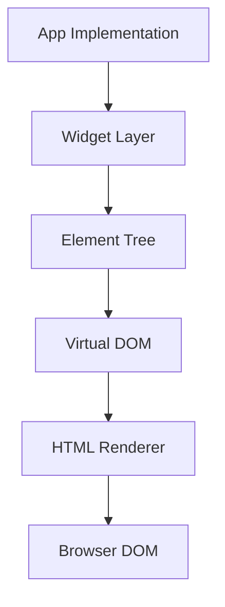

# FlutterJS Engine Architecture

System design and module interaction guide.

## Overview

The FlutterJS Engine is designed to run in two distinct environments:
1.  **Runtime**: The browser (or any JS environment), where the app actually runs.
2.  **Build Time**: The Node.js environment, where the app is compiled and bundled.

## 1. Runtime Architecture

The runtime architecture mimics the Flutter architecture but adapted for the DOM.

### The Three Trees
Just like Flutter, we maintain parallel tree structures:

1.  **Widget Tree**: Immutable configuration (the code you write).
2.  **Element Tree**: Instantiated objects that hold state and lifecycle.
3.  **VNode Tree (RenderObject)**: The lightweight virtual DOM representation.

### Rendering Pipeline
1.  `build()` is called on a Widget.
2.  A tree of Widgets is returned.
3.  Elements are updated/created to match the Widgets.
4.  Elements generate a Virtual DOM (VNode) tree.
5.  Diffing algorithm compares new VNodes with old VNodes.
6.  Patches are applied to the actual DOM.

### State Management
- **setState()**: Triggers a rebuild of the Sub-tree rooted at the Stateful Element.
- **InheritedWidget**: efficient propagation of data down the tree (used for Theme, Media Query).

## 2. CLI & Build Architecture

The CLI tools (`src/cli/`) handle the "compilation" process. Since code is already Dart-transpiled-to-JS (via `flutterjs_tools`), this engine's CLI focuses on **bundling**.

### Build Pipeline
1.  **Analysis**: Scan `main.fjs` (or `.js`) entry point.
2.  **Project Generation**: Create `.flutter_js/` temp directory.
3.  **Bundling**: Resolve all imports (Standard ESM).
4.  **Tree Shaking**: Remove unused widget exports.
5.  **Minification**: Compress JS/CSS.
6.  **Assets**: Copy/optimize assets to `dist/`.

## 3. Key Differentiators

### Semantic HTML
Unlike Flutter Web (Canvas/WASM), FlutterJS renders `
`, `
`, `<button>`.
- `Text('Hi')` -> `
Hi
`
- `Container()` -> `
`
- `Image()` -> ``

### CSS Token System
Styles are not inline strings; they are managed via a CSS class system (`src/styles/`) mimicking Material tokens. This reduces JS payload size.

## 4. Module Interaction

- **Widgets** depend on **Core**.
- **Material** depends on **Widgets** and **Theme**.
- **Runtime** bootstraps the **Root Widget**.
