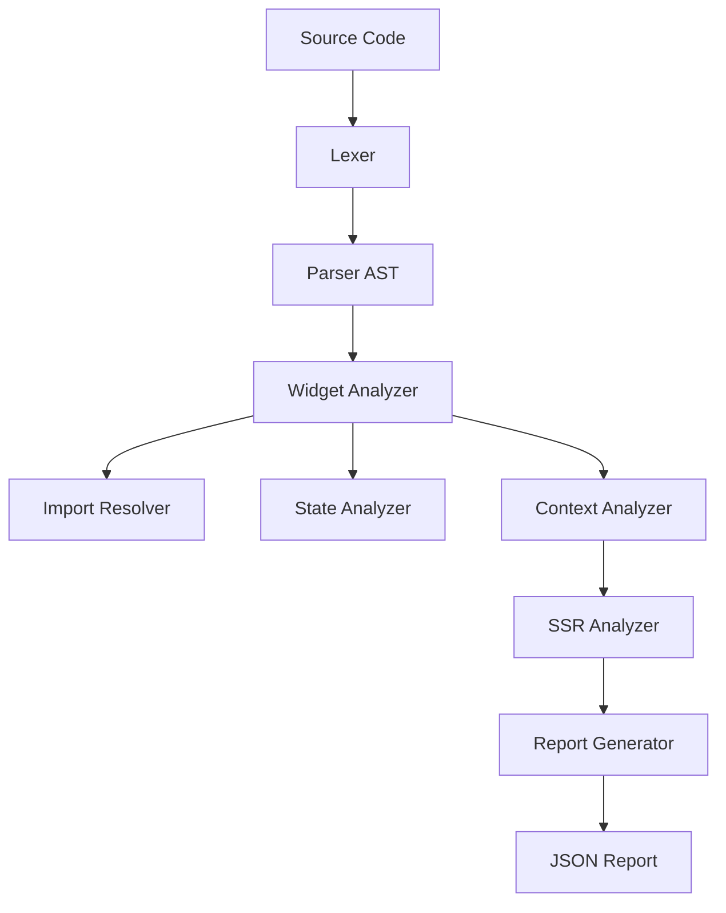

# Analyzer Architecture

The `@flutterjs/analyzer` package uses a multi-stage pipeline to analyze Flutter code written in JavaScript (or converting from Dart).

## The Analysis Pipeline

The `Analyzer` class orchestrates a 10-step process:

### Phase 1: Syntax Analysis
1.  **Lexing (`lexer.js`)**: Tokenizes the source string into a stream of tokens.
2.  **Parsing (`flutterjs_parser.js`)**: Converts tokens into an Abstract Syntax Tree (AST). This parser is specialized to handle Flutter-specific syntax patterns in JS.

### Phase 2: Structural Analysis
3.  **Widget Analysis (`flutterjs_widget_analyzer.js`)**:
    - Identifies classes extending `StatelessWidget`, `StatefulWidget`, or `State`.
    - Extracts properties (fields) and methods.
    - Finds the `main()` function and the root widget passed to `runApp()`.
    - Builds a static Widget Tree.

4.  **Import Resolution (`flutter_import_resolver.js`)**:
    - Scans AST for `import` statements.
    - Resolves them to actual file paths or framework packages.
    - Checks for missing dependencies.

### Phase 3: Semantic Analysis
5.  **State Analysis (`state_analyzer_implementation.js`)**:
    - Links `StatefulWidget` to its `State` class.
    - Checks for `setState()` calls.
    - Validates state mutation patterns.

6.  **Context Analysis (`context_analyzer.js`)**:
    - Tracks `BuildContext` usage.
    - Identifies `InheritedWidget` providers and consumers.
    - Detects context access points.

### Phase 4: Compatibility Analysis
7.  **SSR Analysis (`ssr_analyzer.js`)**:
    - Checks code for server-side rendering safety.
    - Flags browser-only APIs (like `window`, `document`) used in build methods.

### Phase 5: Reporting
8.  **Report Generation**: Compiles all findings into a structured JSON object.
9.  **Output**: Writes to console or file.
