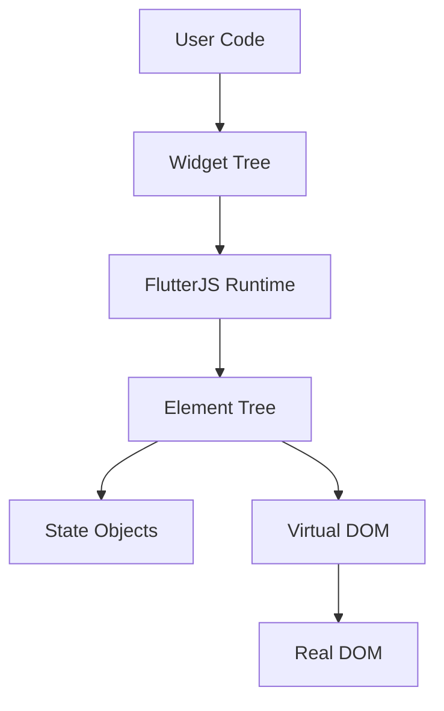

# Runtime Architecture

The `@flutterjs/runtime` package is the heart of the framework. It implements the reactive widget system found in Flutter, adapted for JavaScript.

## Core Components

### 1. FlutterJSRuntime
The entry point (`flutterjs_runtime.js`) orchestrates the application.
- **Initialization**: Sets up error boundaries and performance tracking.
- **runApp(Widget)**: Takes a widget, creates its element, and initiates the first build.
- **Update Scheduling**: Manages the build queue for dirty elements.

### 2. Element System (`element.js`)
Elements are the mutable agents managing the immutable widgets.
- **StatelessElement**: Calls `widget.build()`.
- **StatefulElement**: Manages a `State` object.
- **ComponentElement**: For raw functional components.

### 3. State Management (`state.js`)
Implements the `State<T>` pattern.
- **setState()**: Schedules a filtered rebuild.
- **Batching**: Updates are batched via `UpdateBatcher` to prevent layout thrashing.

### 4. BuildContext (`build_context.js`)
A handle to the location in the element tree.
- Allows lookups like `context.findAncestorWidgetOfExactType`.

---

## The Rendering Pipeline

1.  **Widget Phase**: User defines an immutable `Widget` configuration.
2.  **Mount Phase**: Runtime creates an `Element` for the widget.
3.  **Build Phase**: Element calls `build()` to produce child widgets.
4.  **VNode Phase**: Widget tree is converted to a VNode tree.
5.  **Commit Phase**: VNode tree is diffed and patched to the real DOM.
