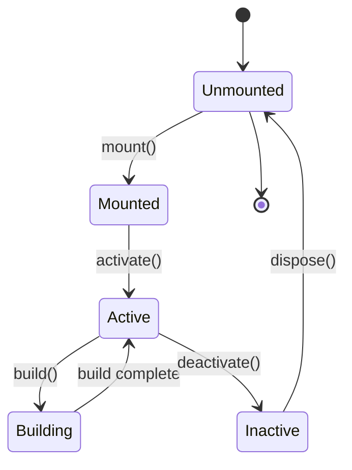

# Widget Lifecycle

Understanding the lifecycle of a widget is crucial for managing resources and state.

## Lifecycle States

## Lifecycle Methods (StatefulWidget)

### 1. Creation
- **`createState()`**: Called immediately when the `StatefulElement` is created.
- **`initState()`**: Called once when the state object is inserted into the tree.
- **`didChangeDependencies()`**: Called immediately after `initState` and whenever a dependency (InheritedWidget) changes.

### 2. Re-building
- **`build()`**: Called frequently. Must be pure and fast.
- **`didUpdateWidget(oldWidget)`**: Called when the parent rebuilds and sends a new widget configuration. State is preserved.
- **`setState()`**: Triggers a rebuild manually.

### 3. Destruction
- **`deactivate()`**: Called when the object is removed from the tree (can be reinserted).
- **`dispose()`**: Called when the object is permanently removed. Clean up controllers/listeners here.

## Element Lifecycle

1.  **Mounting**: The element initializes its state and child interaction.
2.  **Updating**: The element compares the old widget and new widget.
    - If type matches: Update widget reference and call `build`.
    - If type changes: Unmount old element, replace with new element.
3.  **Unmounting**: Recursively disposes children and clears resources.
