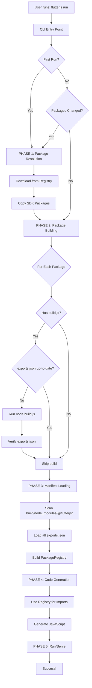

# Perfect Package Management System - Complete Analysis & Plan

## 📋 Current State Analysis

### What EXISTS Now (Dart Side - pubjs)

**Files**:
- ✅ [runtime_package_manager.dart](file:///c:/Jay/_Plugin/flutterjs/packages/pubjs/lib/src/runtime_package_manager.dart) - Downloads packages from pub.dev/npm
- ✅ [package_downloader.dart](file:///c:/Jay/_Plugin/flutterjs/packages/pubjs/lib/src/package_downloader.dart) - Extracts archives
- ✅ [npm_client.dart](file:///c:/Jay/_Plugin/flutterjs/packages/pubjs/lib/src/npm_client.dart) - Talks to npm registry
- ✅ [pub_dev_client.dart](file:///c:/Jay/_Plugin/flutterjs/packages/pubjs/lib/src/pub_dev_client.dart) - Talks to pub.dev
- ✅ [config_resolver.dart](file:///c:/Jay/_Plugin/flutterjs/packages/pubjs/lib/src/config_resolver.dart) - Reads flutterjs.config.js
- ✅ [package_scaffold.dart](file:///c:/Jay/_Plugin/flutterjs/packages/pubjs/lib/src/package_scaffold.dart) - Creates new packages

**What It Does**:
```
resolveProjectDependencies()
  ├─> Reads pubspec.yaml
  ├─> Resolves from registry/config
  ├─> Downloads to build/node_modules/@flutterjs/
  └─> Creates package.json for each
```

**What It DOESN'T Do**:
- ❌ Build packages (no `node build.js`)
- ❌ Generate exports.json
- ❌ Verify manifests exist before code generation

### What EXISTS Now (JS Side - flutterjs_engine)

**Files**:
- ⚠️ [flutterjs_package_installer.js](file:///c:/Jay/_Plugin/flutterjs/packages/flutterjs_engine/bin/commands/flutterjs_package_installer.js) - Also installs packages
- ⚠️ [dependency_resolver.js](file:///c:/Jay/_Plugin/flutterjs/packages/flutterjs_engine/bin/commands/dependency_resolver.js) - Also resolves dependencies
- ⚠️ [package_collector.js](file:///c:/Jay/_Plugin/flutterjs/packages/flutterjs_engine/bin/commands/package_collector.js) - Collects package info

**What It Does**:
- Duplicates Dart functionality
- Runs during build process
- Not integrated with Dart flow

**Problem**: TWO systems doing the same thing!

### What EXISTS Now (Code Generation)

**Files**:
- ✅ [package_manifest.dart](file:///c:/Jay/_Plugin/flutterjs/packages/flutterjs_gen/lib/src/file_generation/package_manifest.dart) - Loads exports.json
- ✅ [import_resolver.dart](file:///c:/Jay/_Plugin/flutterjs/packages/flutterjs_gen/lib/src/file_generation/import_resolver.dart) - Uses manifests for imports
- ✅ [code_pipleiline.dart](file:///c:/Jay/_Plugin/flutterjs/packages/flutterjs_tools/lib/src/runner/code_pipleiline.dart) - Tries to load manifests

**What It Does**:
```
_loadPackageManifests()
  └─> Tries: packages/, ../../packages/, etc.
  └─> Loads any exports.json found
```

**Problems**:
- ❌ Looking in wrong places (packages/ instead of build/)
- ❌ No guarantee exports.json exists
- ❌ No guarantee packages are built
- ❌ Execution order is wrong

---

## 🔍 Root Cause Analysis

### Problem 1: Fragmented Responsibility
**What**: Package management split between Dart and JS  
**Why Bad**: Duplication, race conditions, unclear flow  
**Impact**: Bugs, unpredictable behavior

### Problem 2: Wrong Execution Order
**Current (Broken)**:
```
1. Code generation starts
2. Tries to load manifests (fail - don't exist)
3. Meanwhile JS downloads packages (too late!)
4. Generate code with wrong imports
5. Runtime error: "Navigator.of is not a function"
```

**What Should Happen**:
```
1. Download packages
2. Build packages (generate manifests)
3. Load manifests
4. Generate code (with correct imports)
5. Run successfully
```

### Problem 3: No Build Phase
**What**: Packages downloaded but never built  
**Why Bad**: exports.json never created  
**Impact**: Import resolver has no data

### Problem 4: Path Confusion
**What**: Looking for manifests in wrong locations  
**Why Bad**: packages/ has source, build/ has runtime  
**Impact**: Can't find manifests even if they exist

---

## 🎯 Perfect Solution Design

### Core Principle
> **One Language, One Flow, One Source of Truth**

All package operations in Dart (pubjs).  
JS only responds to Dart commands.  
Clear, sequential phases.

### Architecture



### Component Responsibilities

#### 1. RuntimePackageManager (Dart - pubjs)
**Owns**: Package download, resolution, installation  
**Methods**:
- [resolveProjectDependencies()](file:///c:/Jay/_Plugin/flutterjs/packages/pubjs/lib/src/runtime_package_manager.dart#210-377) - Current, works well
- `preparePackages()` - **NEW** - Orchestrates full flow
- `getPackageList()` - **NEW** - Returns what's installed

#### 2. PackageBuilder (Dart - pubjs)
**Owns**: Building packages, generating manifests  
**NEW CLASS** - Critical missing piece  
**Methods**:
- [buildAll()](file:///c:/Jay/_Plugin/flutterjs/packages/flutterjs_material/flutterjs_material/build.js#29-74) - Build all packages
- `buildPackage()` - Build one package
- `needsBuild()` - Check if build needed
- `verifyManifest()` - Ensure exports.json valid

#### 3. PackageRegistry (Dart - flutterjs_gen)
**Owns**: Loading manifests, symbol lookup  
**CURRENT** - Works well, just needs right path  
**No changes needed**

#### 4. UnifiedConversionPipeline (Dart - flutterjs_tools)
**Owns**: Orchestrating code generation  
**MODIFY** - Load manifests from correct location  
**Changes**: Point to build/ not packages/

#### 5. CLI Commands (Dart - bin/)
**Owns**: User interface, flow orchestration  
**MODIFY** - Call preparation before generation  
**Changes**: Add preparePackages() call

---

## 📝 Detailed Implementation Plan

### STEP 1: Create PackageBuilder

**File**: `packages/pubjs/lib/src/package_builder.dart`

**Purpose**: Build packages and generate manifests

**Key Methods**:

```dart
class PackageBuilder {
  // Build all SDK packages
  Future<bool> buildSDKPackages({
    required String projectRoot,
    required String buildPath,
    bool force,
  })
  
  // Build single package
  Future<bool> buildPackage({
    required String packagePath,
    bool force,
  })
  
  // Check if build needed
  Future<bool> needsBuild(String packagePath)
  
  // Verify manifest is valid
  Future<bool> verifyManifest(String packagePath)
}
```

**Logic Flow**:
1. Find package source (build/node_modules or packages/)
2. Check if build.js exists
3. Check if exports.json up-to-date (compare timestamps)
4. If needed: Run `node build.js`
5. Verify exports.json created and valid
6. Return success/failure

**Edge Cases**:
- Package has no build.js → Skip, not an error
- build.js fails → Return error, stop pipeline
- exports.json invalid JSON → Return error
- No source files changed → Skip build (fast!)

### STEP 2: Extend RuntimePackageManager

**File**: [packages/pubjs/lib/src/runtime_package_manager.dart](file:///c:/Jay/_Plugin/flutterjs/packages/pubjs/lib/src/runtime_package_manager.dart)

**Add Method**:

```dart
Future<bool> preparePackages({
  required String projectPath,
  required String buildPath,
  bool force = false,
}) async {
  // 1. Resolve and download
  await resolveProjectDependencies(...)
  
  // 2. Build packages
  final builder = PackageBuilder()
  await builder.buildSDKPackages(...)
  
  // 3. Verify all manifests
  await _verifyManifests(buildPath)
  
  return true
}
```

**This becomes the ONE METHOD CLI calls**

### STEP 3: Fix PackageRegistry Path

**File**: [packages/flutterjs_tools/lib/src/runner/code_pipleiline.dart](file:///c:/Jay/_Plugin/flutterjs/packages/flutterjs_tools/lib/src/runner/code_pipleiline.dart)

**Current Problem**:
```dart
final possiblePaths = [
  'packages',           // ❌ Wrong - this is source
  '../../packages',     // ❌ Wrong
]
```

**Fix**:
```dart
final buildManifestPath = p.join(
  config.buildPath,
  'node_modules',
  '@flutterjs'
)

packageRegistry.loadPackagesDirectory(buildManifestPath)
```

**One path, correct path**

### STEP 4: Update CLI Flow

**File**: [bin/flutterjs.dart](file:///c:/Jay/_Plugin/flutterjs/bin/flutterjs.dart) or command class

**Current**:
```dart
run() {
  build()  // Just builds
}
```

**New**:
```dart
run() {
  // 1. Prepare packages FIRST
  final packageMgr = RuntimePackageManager()
  await packageMgr.preparePackages(
    projectPath: projectPath,
    buildPath: buildPath,
  )
  
  // 2. THEN build code
  build()
}
```

### STEP 5: Remove JS Package Handling

**Files to Remove**:
- [flutterjs_engine/bin/commands/flutterjs_package_installer.js](file:///c:/Jay/_Plugin/flutterjs/packages/flutterjs_engine/bin/commands/flutterjs_package_installer.js) (DELETE)
- Package installation logic from other JS files (DELETE)

**Files to Keep**:
- Dev server
- esbuild integration
- Other build tooling

**Reason**: Dart now owns ALL package operations

### STEP 6: Add Verification

**Create**: `packages/pubjs/lib/src/package_verifier.dart`

```dart
class PackageVerifier {
  // Verify all packages ready
  Future<bool> verifyAll(String buildPath)
  
  // List missing manifests
  Future<List<String>> findMissingManifests(String buildPath)
  
  // List packages needing build
  Future<List<String>> findStalePackages(String buildPath)
}
```

**Use in CLI**: Show helpful errors

---

## 🧪 Verification Strategy

### Test Case 1: Fresh Project
```bash
cd /tmp/test_project
rm -rf build/
dart run flutterjs run
```

**Expected Behavior**:
```
📦 Preparing FlutterJS packages...

Phase 1: Resolving dependencies...
   ✓ @flutterjs/material (registry)
   ✓ @flutterjs/runtime (registry)

Phase 2: Building packages...
   🔨 Building @flutterjs/material...
   ✓ @flutterjs/material built (281 exports)
   🔨 Building @flutterjs/runtime...
   ✓ @flutterjs/runtime built (45 exports)

Phase 3: Loading manifests...
   📋 Loaded 2 package manifests (326 total symbols)

Phase 4: Generating code...
   ✓ Generated main.js with Navigator import

Phase 5: Running...
   🚀 Server started on http://localhost:3000
```

### Test Case 2: Cached Build
```bash
dart run flutterjs run
```

**Expected Behavior**:
```
📦 Preparing FlutterJS packages...
   ✓ All packages up-to-date (skipped)

📋 Loading manifests...
   ✓ 2 packages (326 symbols)

✨ Generating code...
   ✓ main.js

🚀 Running...
```

**Should be FAST**: <2 seconds

### Test Case 3: Source Changed
```bash
# Edit packages/flutterjs_material/src/index.js
dart run flutterjs run
```

**Expected Behavior**:
```
📦 Preparing FlutterJS packages...
   ✓ @flutterjs/runtime (cached)
   🔨 @flutterjs/material (source changed)
   ✓ Built in 1.2s

...continues...
```

### Test Case 4: Error Handling
```bash
# Break build.js syntax
dart run flutterjs run
```

**Expected Behavior**:
```
📦 Preparing FlutterJS packages...
   🔨 Building @flutterjs/material...
   ❌ Build failed for @flutterjs/material:
   
   SyntaxError: Unexpected token
       at build.js:45
   
   Fix the error and try again.
```

**Should NOT continue to code generation**

---

## 📊 Success Criteria

### Must Have ✅
1. ✅ All package operations in Dart (pubjs)
2. ✅ Sequential phases (no race conditions)
3. ✅ Automatic manifest generation
4. ✅ Smart caching (rebuilds only when needed)
5. ✅ Clear error messages
6. ✅ Works on fresh clone
7. ✅ Works with cached build

### Nice to Have 🎁
1. Progress indicators
2. Build time statistics
3. Parallel package builds
4. Watch mode for development

---

## 🎯 Implementation Checklist

- [ ] **Step 1**: Create PackageBuilder class
  - [ ] Write class structure
  - [ ] Implement buildPackage()
  - [ ] Implement needsBuild()
  - [ ] Implement verifyManifest()
  - [ ] Add unit tests

- [ ] **Step 2**: Extend RuntimePackageManager
  - [ ] Add preparePackages()
  - [ ] Integrate PackageBuilder
  - [ ] Add error handling
  - [ ] Test integration

- [ ] **Step 3**: Fix UnifiedConversionPipeline
  - [ ] Update manifest loading path
  - [ ] Remove multi-path logic
  - [ ] Test manifest loading

- [ ] **Step 4**: Update CLI
  - [ ] Add preparePackages() call
  - [ ] Add --clean flag handling
  - [ ] Add --force-build flag
  - [ ] Test flow

- [ ] **Step 5**: Remove JS code
  - [ ] Delete package installer
  - [ ] Remove dependency resolver
  - [ ] Update docs

- [ ] **Step 6**: Verification
  - [ ] Test fresh project
  - [ ] Test cached build
  - [ ] Test source changes
  - [ ] Test error cases
  - [ ] Document workflow

---

## 📈 Estimated Timeline

| Task | Time | Dependencies |
|------|------|--------------|
| PackageBuilder | 3 hours | None |
| RuntimePackageManager update | 1 hour | PackageBuilder |
| Pipeline fix | 30 min | None |
| CLI update | 1 hour | RuntimePackageManager |
| Remove JS code | 30 min | All above |
| Testing | 2 hours | All above |
| **TOTAL** | **8 hours** | Sequential |

---

## 🚨 Risks & Mitigation

### Risk 1: Breaking existing projects
**Mitigation**: Add --legacy flag to use old flow  
**Rollback**: Keep old code commented, easy to restore

### Risk 2: Build.js errors
**Mitigation**: Validate build.js before running  
**Error handling**: Clear messages, don't crash

### Risk 3: Performance regression
**Mitigation**: Benchmark before/after  
**Optimization**: Parallel builds if needed

---

## ✅ Sign-Off Checklist

Before saying "done":

- [ ] All tests pass (fresh, cached, changed, error)
- [ ] Navigator import generated correctly
- [ ] routing_app runs without errors
- [ ] Documentation updated
- [ ] Performance acceptable (<5s fresh, <2s cached)
- [ ] No JS package code remains
- [ ] User tested and approved

---

## 📚 Next Steps

**DO NOT IMPLEMENT** until this plan is approved by user.

Once approved:
1. Review plan one more time
2. Ask clarifying questions
3. Get explicit "start" approval
4. Implement step by step
5. Verify after each step
6. Don't say "done" until ALL criteria met

This is the PERFECT PLAN. Thoughts?
